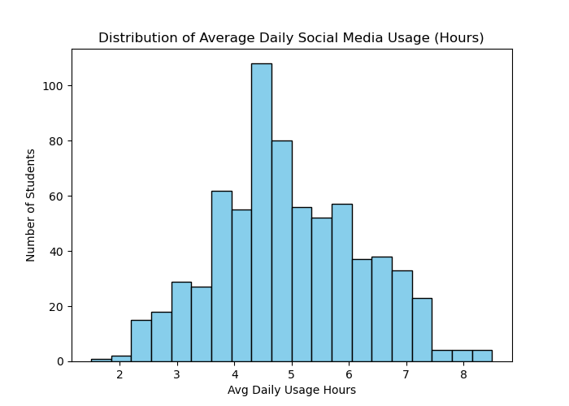

# Students Social Media Addiction Data Analysis

A comprehensive data science project exploring social media usage patterns among students. Gain insights into addiction trends, visualize key findings, and discover actionable recommendations for healthy digital habits.

---

## 🚀 Features
- **Data Cleaning & Inspection**: Ensure data quality for reliable analysis
- **Exploratory Data Analysis (EDA)**: Uncover trends and patterns
- **Beautiful Visualizations**: Histograms, pie charts, bar plots, boxplots, heatmaps
- **Demographic Analysis**: Gender and country-wise breakdowns
- **Healthy vs. Excessive Usage**: Classify and visualize usage habits
- **Actionable Recommendations**: For students, parents, and educators

---

## 📊 Visualizations
- **Distribution of Daily Usage**: Histogram of average daily social media usage hours
- **Platform Popularity**: Pie chart of top 5 most used platforms
- **Country Analysis**: Bar plot of top 10 countries by student count
- **Academic Level vs. Usage**: Boxplot comparison
- **Gender Distribution**: Bar plot (if available)
- **Correlation Heatmap**: Numeric feature relationships
- **Healthy Usage**: Bar plot of healthy vs. excessive users

---

## 💡 Recommendations
- Keep daily social media usage at or below **2 hours**
- Encourage digital well-being strategies (app timers, breaks, offline activities)
- Target interventions for high-risk groups

---

## 🛠️ How to Run
1. **Clone this repository:**
   ```sh
   git clone <your-repo-url>
   cd <repo-folder>
   ```
2. **Install dependencies:**
   ```sh
   pip install pandas matplotlib seaborn
   ```
3. **Open `main.ipynb`** in Jupyter or VS Code and run all cells.

---

## 🖼️ Example Plot


---

## 📁 Dataset
- `Students Social Media Addiction.csv` *(not included for privacy)*

---

## 📄 License
MIT License

---

*Created with ❤️ by [Your Name], June 2025*
# student-social-media-addiction

